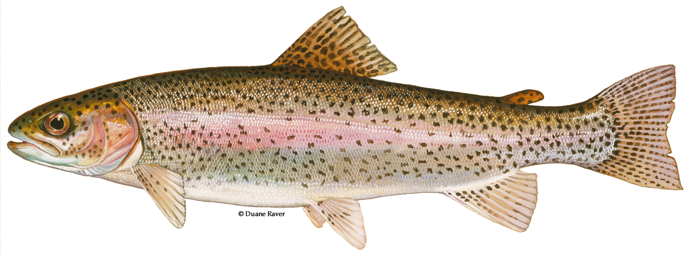

```{r setup, include=FALSE}
knitr::opts_chunk$set(echo = TRUE, message=FALSE, warning=FALSE)
```

## Here's a useful and descriptive introductory summary! 
Curious where the data comes from? [Look no further!](http://www.cbr.washington.edu/dart/query/adult_graph_text)

### Here's an image of a steelhead trout! 

[(Photo by Visitor7)](https://en.wikipedia.org/wiki/Bonneville_Dam)



### And here's an image of the Bonneville Dam! 

(Photo by Duane Raver)


## Now let's get into the code!

Load necessary packages and data
```{r}
library(tidyverse)
library(janitor)
library(lubridate)
library(tsibble)
library(feasts)

raw_fish <- read_csv("cbr_fish_passage_bonneville_allyrs_steelhead.csv") %>% 
  clean_names()
```

Tidy the data
```{r}
fish <- raw_fish %>%
  #drop_na(value) %>% #drop NA values
  #filter(value>=0) %>% #drop negative values because metadata doesn't explain what they mean
  separate(mm_dd, into=c("day", "month")) %>% #separate out month and day
  mutate(yr_mo_day = paste(year, match(month,month.abb), day, sep="-"), #combine all date columns and separate by -
         yr_mo = paste(year, match(month,month.abb), sep="-"),
         date = as.Date(yr_mo_day)) %>% #tell R this is a date
  filter(!is.na(date)) %>% #REMOVE DARN LEAP YEAR DATES (Feb 29th)
  mutate(year_month = tsibble::yearmonth(yr_mo_day)) %>% #tell R this is a date
  select("year", "year_month", "yr_mo", "date", "value") #remove unnecessary variables
```

### Look at the data day-by-day (original time series observations)
```{r}
fish_day <- ggplot(data=fish, aes(x=date, y=value)) +
  geom_line()

fish_day
```

Double check you did it right by looking at the first 1000 observations
```{r}
fish_trimmed <- tail(fish, n=1000)

ggplot(data=fish_trimmed, aes(x=date, y=value)) +
  geom_line()
```

Look at the data month-by-month
```{r}
fish_month <- ggplot(data=fish, aes(x=year_month, y=value)) +
  geom_line()

fish_month
```

Look at the data year-by-year
```{r}
fish_yr <- ggplot(data=fish, aes(x=year, y=value)) +
  geom_line()

fish_yr
```

### Make a season plot
```{r}
#Coerce dataframe to a tsibble
fish_ts <- as_tsibble(fish, index= year_month)

duplicates(fish, index=year_month)

#plot tsibble fancy plots
fish_ts %>% autoplot(value)
fish_ts %>% gg_subseries(value)
```

Check out that sweet trout spawning season!

```{r}
#prep data frame for season plot
fish_summary <- fish %>% 
  group_by(yr_mo) %>%
  summarise(sums=sum(value)) %>% 
  mutate(year_month = tsibble::yearmonth(yr_mo), #tell R this is a date
         month = month(year_month, label = TRUE),
         year = year(year_month),
         sums=replace_na(sums, 0)) #replace NA values with 0

#coerce data frame into a tsibble
fish_summary_ts <- as_tsibble(fish_summary, index= year_month) %>% 
  fill_gaps() #fill gaps because some dates didn't take measurements

#plot season plot
fish_summary_ts %>% gg_season(sums)

#make the same season plot but now in ggplot
ggplot(data=fish_summary, aes(x=month, y=sums, group=year)) +
  geom_line(aes(color=year))
```

### Visualize annual steelhead passage counts
```{r}
#prep data frame for annual counts plot
fish_annual <- fish_summary %>% 
  group_by(year) %>% 
  summarize(sumsofsums=sum(sums))

#plot it
ggplot(data=fish_annual, aes(x=year, y=sumsofsums)) +
  geom_line()
```

